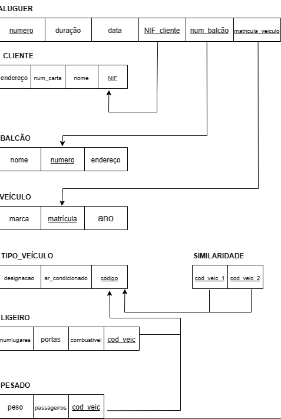
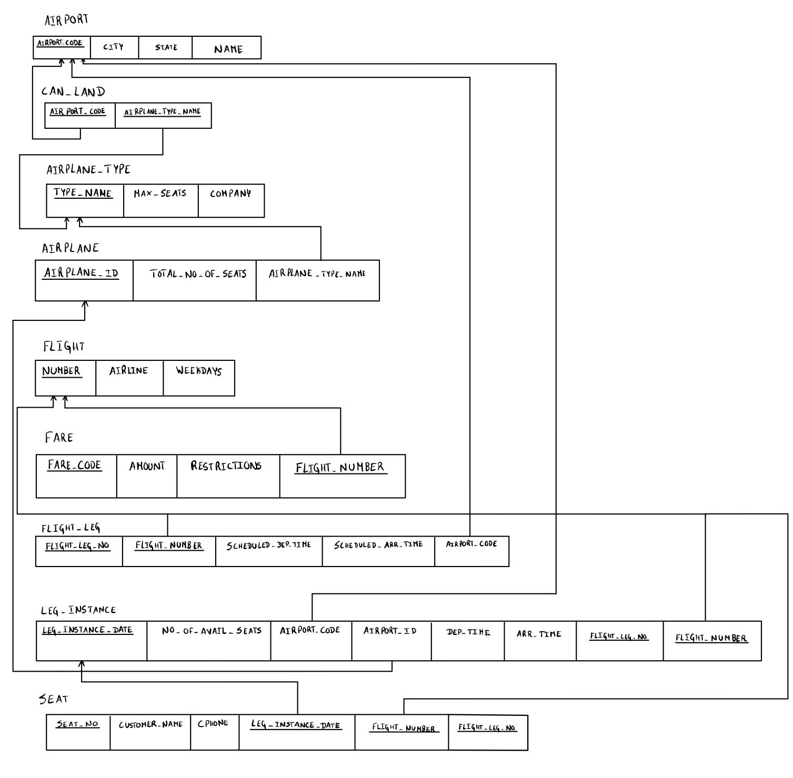
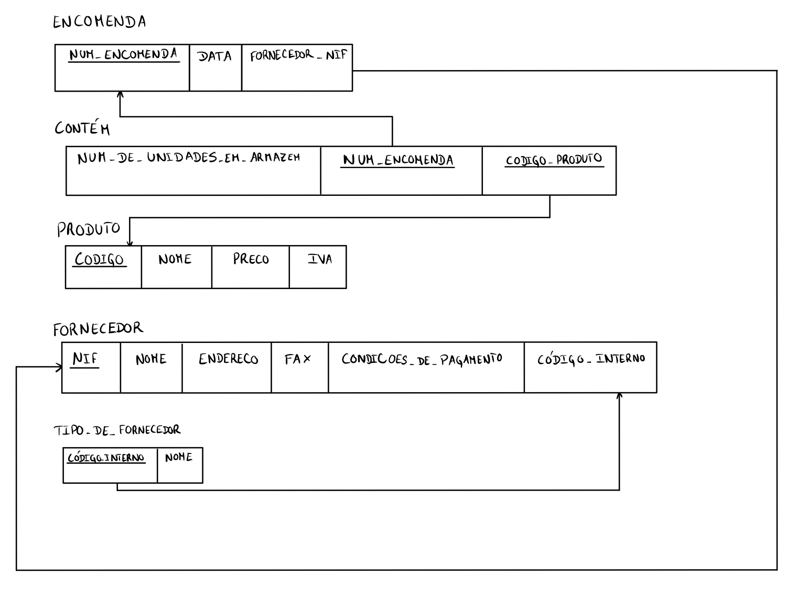
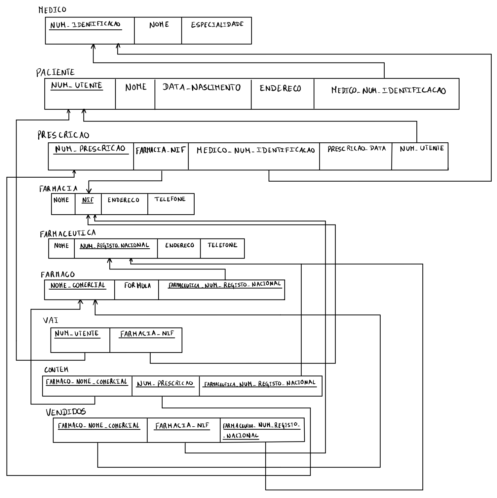
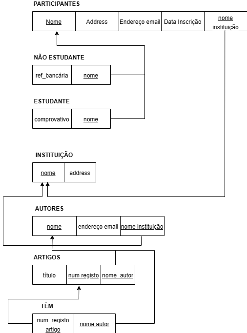
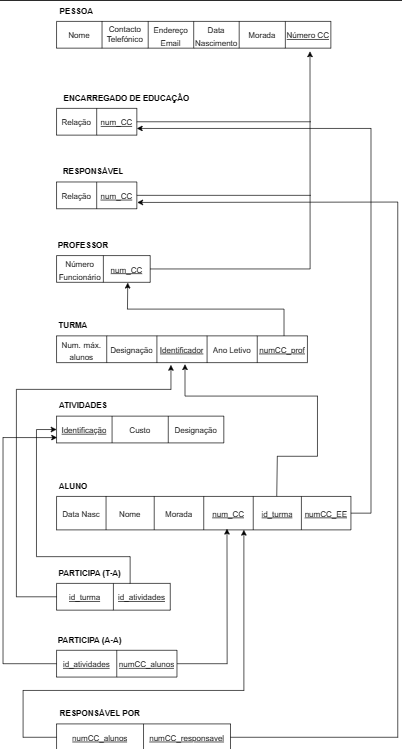

# BD: Guião 3


## ​Problema 3.1
 
### *a)*

```
... Write here your answer ...
```


### *b)* 

```
... Write here your answer ...
```


### *c)* 




## ​Problema 3.2

### *a)*

```
Cliente (nome, endereço, num_carta, NIF*)
Aluguer (número*, duração, data)
Balcão (nome, número*, endereço)
Veículo (matrícula*, marca, ano)
Tipo Veículo (designação, ar condicionado, código*)
Ligeiro (numlugares, portas, combustível)
Pesado (peso, passageiros)
Similaridade (código veículo 1*, código veículo 2*)
```


### *b)* 

```
Candidate keys:
Cliente(num_carta, NIF)
Aluguer(número)
Balcão(número)
Veículo(matrícula)
Tipo Veículo(código)

Primary keys:
Cliente - NIF
Aluguer - número
Balcão - número
Veículo - matrícula
Tipo Veículo - código
Ligeiro - cod_veículo
Pesado - cod_veículo
Similaridade - (cod_veic_1, cod_veic_2)

Foreign keys:
Aluguer - (NIF_cliente, num_balcão, matrícula_veículo)
Ligeiro - cod_veículo
Pesado - cod_veículo
Similaridade - (cod_veic_1, cod_veic_2)
```


### *c)* 




## ​Problema 3.3


### *a)* 2.1



### *b)* 2.2



### *c)* 2.3



### *d)* 2.4

