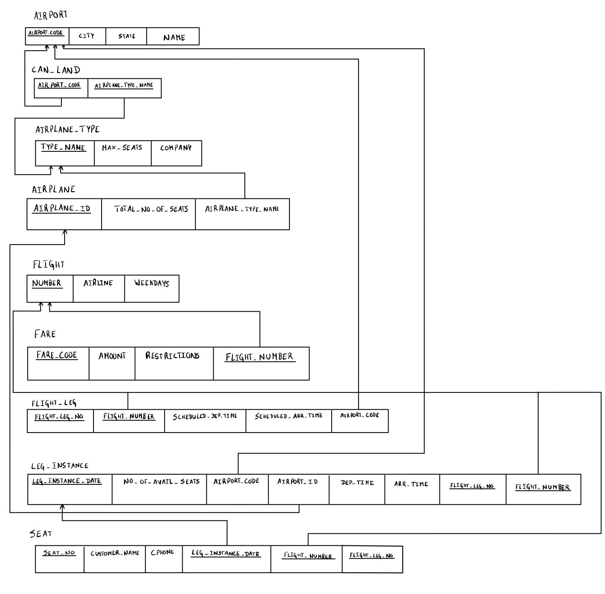

# BD: Guião 3

## ​Problema 3.1

### *a)*

```
Cliente (nome, endereço, num_carta, NIF*)
Aluguer (número*, duração, data)
Balcão (nome, número*, endereço)
Veículo (matrícula*, marca, ano)
Tipo Veículo (designação, ar condicionado, código*)
Ligeiro (numlugares, portas, combustível)
Pesado (peso, passageiros)
Similaridade (código veículo 1*, código veículo 2*)
```

### *b)*

```
Candidate keys:
Cliente(num_carta, NIF)
Aluguer(número)
Balcão(número)
Veículo(matrícula)
Tipo Veículo(código)

Primary keys:
Cliente - NIF
Aluguer - número
Balcão - número
Veículo - matrícula
Tipo Veículo - código
Ligeiro - cod_veículo
Pesado - cod_veículo
Similaridade - (cod_veic_1, cod_veic_2)

Foreign keys:
Aluguer - (NIF_cliente, num_balcão, matrícula_veículo)
Ligeiro - cod_veículo
Pesado - cod_veículo
Similaridade - (cod_veic_1, cod_veic_2)
```

### *c)*


## ​Problema 3.2

### *a)*

```
Airport (Airport_Code*, City, State, Name)
Can_Land (Airport_Code*, Airplane_Type_Name*)
Airplane_Type (Type_Name*, Max_Seats, Company)
Airplane (Airplane_Id*, Total_No_Of_Seats, Airplane_Type_Name)
Flight (Number*, Airplane, Weekdays)
Fare (Fare_Code*, Amount, Restrictions, Flight_Number*)
Flight_Leg (Flight_Leg_No*, Flight_Number*, Scheduled_Dep_time, Scheduled_Arr_time, Airport_Code)
Leg_Instance (Leg_instance_Date*, No_Of_Avail_Seats, Airport_Code, Airport_Id, Dep_time, Arr_Time, Flight_Leg_No*, Flight_Number*)
Seat(Seat_No*, Customer_Name, CPhone, Leg_instance_Date*, Flight_Number*, Flight_Leg_No*)
```

### *b)*

```
Candidate Keys:
Airport (Airport_Code)
Can_Land (Airport_Code, Airplane_Type_Name)
Airplane_Type (Type_Name)
Airplane (Airplane_Id)
Flight (Number)
Fare (Fare_Code, Flight_Number)
Flight_Leg (Flight_Leg_No, Flight_Number)
Leg_Instance (Leg_instance_Date, Flight_Leg_No*, Flight_Number)
Seat (Seat_No, Leg_instance_Date, Flight_Number, Flight_Leg_No)


Primary Keys:
Airport - Airport_Code
Can_Land - (Airport_Code*, Airplane_Type_Name*)
Airplane_Type - Type_Name
Airplane - Airplane_Id
Flight - Number
Fare - Fare_Code, Flight_Number
Flight_Leg - Flight_Leg_No, Flight_Number
Leg_Instance - Leg_instance_Date, Flight_Leg_No, Flight_Number
Seat - Seat_No, Leg_instance_Date, Flight_Number, Flight_Leg_No


Foreign keys:
Can_Land - (Airport_Code*, Airplane_Type_Name*)
Airplane - Airplane_Type_Name
Fare - Flight_Number
Flight_Leg - Airport_Code, Flight_Number
Leg_Instance - Airport_Code, Airport_Id, Flight_Leg_No, Flight_Number
Seat - Leg_instance_Date, Flight_Number, Flight_Leg_No

```

### *c)*



## ​Problema 3.3

### *a)* 2.1


### *b)* 2.2


### *c)* 2.3


### *d)* 2.4


