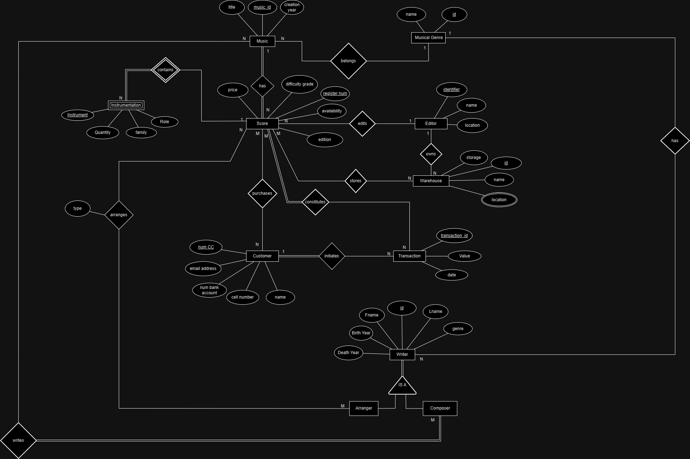
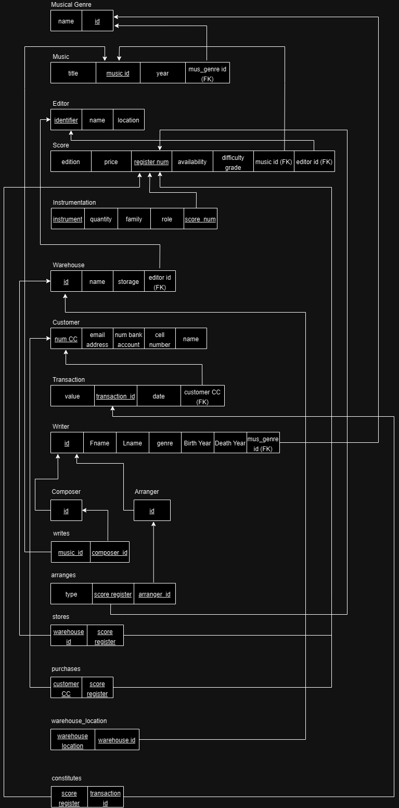
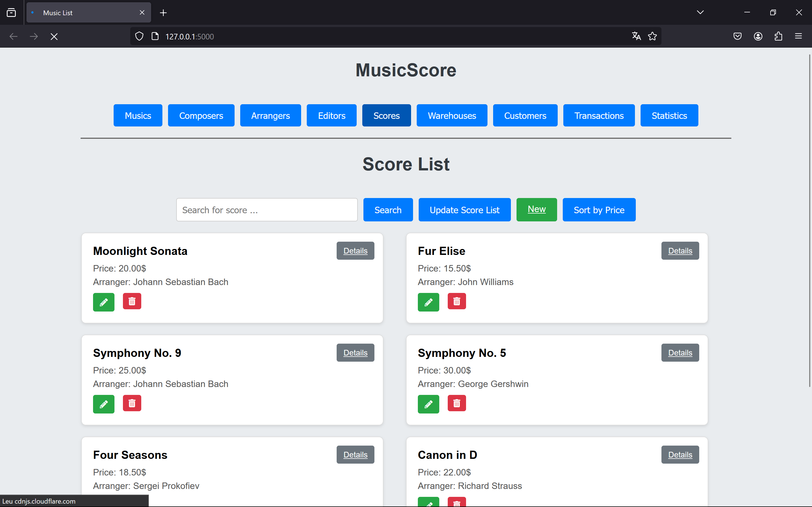
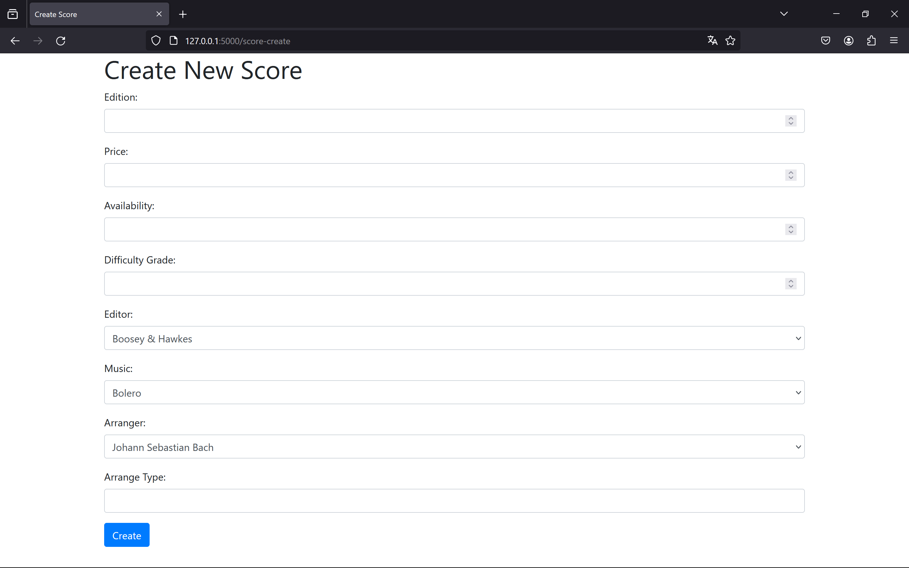
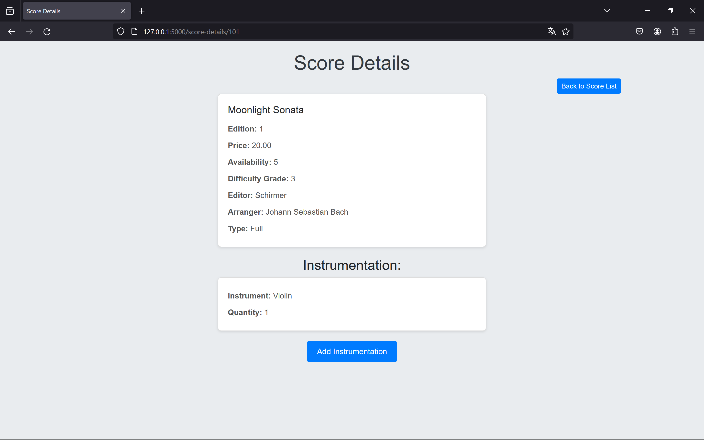
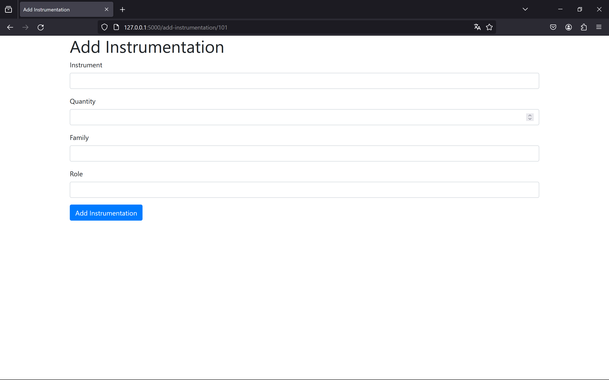
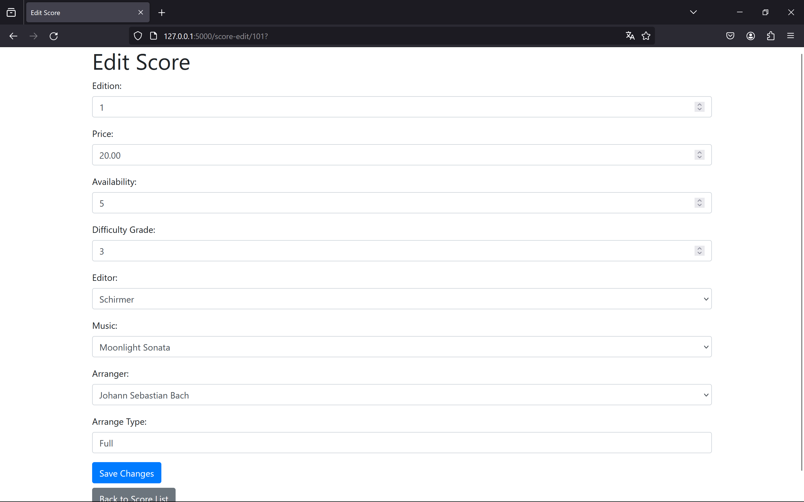

# BD: Trabalho Prático APF-T

**Grupo**: PXGY

- Jorge Domingues, MEC: 113278
- João Monteiro, MEC: 114547

# Instructions - TO REMOVE

Este template é flexível.
É sugerido seguir a estrutura, links de ficheiros e imagens, mas adicione ou remova conteúdo sempre que achar necessário.

---

This template is flexible.
It is suggested to follow the structure, file links and images but add more content where necessary.

The files should be organized with the following nomenclature:

- sql\01_ddl.sql: mandatory for DDL
- sql\02_sp_functions.sql: mandatory for Store Procedure, Functions,...
- sql\03_triggers.sql: mandatory for triggers
- sql\04_db_init.sql: scripts to init the database (i.e. inserts etc.)
- sql\05_any_other_matter.sql: any other scripts.

Por favor remova esta secção antes de submeter.

Please remove this section before submitting.

## Introdução / Introduction

O projeto envolve um sistema de gestão de uma base de dados musical.  Foram definidas algumas entidades, como por exemplo Music, Score, Writer (pode ser Composer ou Arranger), Editor, entre outros. Alguns objetivos consistem na adição, edição, remoção e pesquisa de entidades, para além do objetivo básico de compra de Scores (arranjos), onde é possível visualizar o stock do Warehouse (armazém) e a disponibilidade de um Score.

## ​Análise de Requisitos / Requirements

## DER - Diagrama Entidade Relacionamento/Entity Relationship Diagram

### Versão final/Final version



### APFE

Foi definida a relação entre o Score e o Arranger. Anteriormente a Instrumentation estava relacionada com a Music e passamos a atribuir uma relação Instrumentation-Score.
Em vez de associar o Writer à Music, decidimos associar apenas o Composer à Music. Por último, alteramos ainda a relação entre Musical Genre e Composer para Musical Genre e Writer, uma vez que o Arranger também pode ter definido um género musical.

## ER - Esquema Relacional/Relational Schema

### Versão final/Final Version



### APFE

Para além de fazer as alterações para manter a concordância entre o ER e o DER foi ainda alterada a tabela Instrumentation, onde se alterou a Primary Key (anteriormente definida pelo instrument), para (instrument, score_num).

## ​SQL DDL - Data Definition Language

[SQL DDL File](sql/01_ddl.sql "SQLFileQuestion")

## SQL DML - Data Manipulation Language

Uma secção por formulário.
A section for each form.

Para mostrar o nosso DML, iremos mostrar os exemplos de SELECT, INSERT, DELETE e UPDATE de uma partitura.
No geral, os INSERT's e os UPDATE's foram feitos com Stored Procedures já os DELETE's foram feitos com Triggers.

### Formulario exemplo/Example Form

Inicialmente criamos alguns valores para conseguirmos testar a interação da base de dados com a interface criada



```sql
-- Show data on the form
SELECT s.register_num, s.edition, s.price, s.availability, 
                            s.difficultyGrade, m.title as music, e.name, w.Fname + ' ' + w.Lname as WriterName, ar.type
                            FROM Score s
                            JOIN Music m ON s.musicId = m.music_id
       JOIN Editor e ON s.editorId = e.identifier
       LEFT OUTER JOIN arranges ar ON s.register_num = ar.score_register
       LEFT OUTER JOIN Arranger a ON ar.arranger_id = a.id
       LEFT OUTER JOIN Writer w ON a.id = w.id

-- Insert new element
INSERT INTO Score (register_num, [edition], price, [availability], difficultyGrade, musicId, editorId) VALUES
    (101, 1, 20.00, 5, 3, 1, 1),
    (102, 2, 15.50, 3, 2, 2, 2),
    (103, 1, 25.00, 4, 4, 3, 3),
    (104, 1, 30.00, 2, 5, 4, 4),
    (105, 1, 18.50, 5, 1, 5, 5),
    (106, 1, 22.00, 3, 3, 6, 6),
    (107, 1, 19.99, 4, 2, 7, 7);

```

### Formulario exemplo/Example Form

Para adicionar uma partitura, foi feito um Stored Procedure



```sql
CREATE OR ALTER PROCEDURE add_score
    @edition INT,
    @price DECIMAL(10, 2),
    @availability INT,
    @difficultyGrade INT,
    @musicId INT,
    @editorId INT,
    @arrangerId INT,
    @type VARCHAR(20)
AS
BEGIN
    DECLARE @register_num INT;

    BEGIN

        -- Generate a new register number
        SELECT @register_num = COALESCE(MAX(register_num), 0) + 1 FROM Score;

        -- Insert the new score
        INSERT INTO Score (register_num, edition, price, availability, difficultyGrade, musicId, editorId)
        VALUES (@register_num, @edition, @price, @availability, @difficultyGrade, @musicId, @editorId);

        -- Insert into the arranges table
        INSERT INTO arranges (score_register, arranger_id, [type])
        VALUES (@register_num, @arrangerId, @type);

        -- Check if the editor has warehouses
        IF EXISTS (SELECT 1 FROM Warehouse WHERE editorId = @editorId)
        BEGIN
            -- Insert into the stores table for each warehouse of the editor
            INSERT INTO stores (warehouse_id, score_register)
            SELECT w.id, @register_num
            FROM Warehouse w
            WHERE w.editorId = @editorId;

            PRINT 'Score, arranger, and stores added successfully.';
        END
        ELSE
        BEGIN
            PRINT 'No warehouses found for the specified editor.';
        END
    END
END;
GO
```

### Formulario exemplo/Example Form

Podemos também adicionar alguma instrumentação relacionada com a partitura




```python
def detail_score(register_num: int) -> ScoreDetails:
    with create_connection() as conn:
        with conn.cursor() as cursor:
            # Query para buscar informações detalhadas sobre o compositor
            cursor.execute("""
            SELECT s.register_num, s.edition, s.price, s.availability, 
                            s.difficultyGrade, m.title as music, e.name, w.Fname + ' ' + w.Lname as WriterName, ar.type
                            FROM Score s
                            JOIN Music m ON s.musicId = m.music_id
       JOIN Editor e ON s.editorId = e.identifier
       LEFT OUTER JOIN arranges ar ON s.register_num = ar.score_register
       LEFT OUTER JOIN Arranger a ON ar.arranger_id = a.id
       LEFT OUTER JOIN Writer w ON a.id = w.id
            WHERE s.register_num = ?
            """, (register_num,))
            
            row = cursor.fetchone()
            if row is None:
                return None  # Se nenhuma linha for retornada, o compositor não existe

            # Extrair informações básicas sobre o compositor
            score_info = row[:9]

            # Query para buscar as músicas associadas ao compositor
            cursor.execute("""
                SELECT instrument, quantity
                FROM Instrumentation
                WHERE scoreNum = ?
            """, (register_num,))
            
            instrumentation = {instrumentation[0]: instrumentation[1] for instrumentation in cursor.fetchall()}

            return ScoreDetails(*score_info, instrumentation)


def add_instrumentation(instrument: str, quantity: int, family: str, role: str, register_num: int):
    with create_connection() as conn:
        with conn.cursor() as cursor:

            try:
                cursor.execute("""
                INSERT INTO Instrumentation (instrument, quantity, family, role, scoreNum)
                VALUES (?, ?, ?, ?, ?)
                """,(instrument, quantity, family, role, register_num))
                conn.commit()
            except Exception as e:
                conn.rollback()
                raise ValueError(f"Failed to add instrumentation: {e}")
            finally:
                cursor.close()
                conn.close()
```

### Formulario exemplo/Example Form

Agora iremos mostrar como editamos uma partitura, ou seja, fazemos o UPDATE.



```sql
CREATE OR ALTER PROCEDURE edit_score
    @register_num INT,
    @new_edition INT,
    @new_price DECIMAL(10, 2),
    @new_availability INT,
    @new_difficultyGrade INT,
    @new_music_id INT,
    @new_editor_id INT,
    @new_arranger_id INT,
    @type VARCHAR(20)
AS
BEGIN
    BEGIN

        -- Check if the score exists
        IF NOT EXISTS (SELECT 1 FROM Score WHERE register_num = @register_num)
        BEGIN
            RAISERROR ('Invalid register_num.', 16, 1);
            RETURN;
        END

        -- Check if the new music_id exists
        IF NOT EXISTS (SELECT 1 FROM Music WHERE music_id = @new_music_id)
        BEGIN
            RAISERROR ('Invalid new_music_id.', 16, 1);
            RETURN;
        END

        -- Check if the new editor_id exists
        IF NOT EXISTS (SELECT 1 FROM Editor WHERE identifier = @new_editor_id)
        BEGIN
            RAISERROR ('Invalid new_editor_id.', 16, 1);
            RETURN;
        END

        -- Check if the new arranger_id exists
        IF NOT EXISTS (SELECT 1 FROM Arranger WHERE id = @new_arranger_id)
        BEGIN
            RAISERROR ('Invalid new_arranger_id.', 16, 1);
            RETURN;
        END

        -- Update the score details
        UPDATE Score
        SET edition = @new_edition, price = @new_price, availability = @new_availability, difficultyGrade = @new_difficultyGrade, musicId = @new_music_id, editorId = @new_editor_id
        WHERE register_num = @register_num;

        -- Update the arranges table
        UPDATE arranges
        SET arranger_id = @new_arranger_id, [type] = @type
        WHERE score_register = @register_num;

        -- Delete existing entries in the stores table for the score
        DELETE FROM stores WHERE score_register = @register_num;

        -- Insert into the stores table for each warehouse of the new editor
        INSERT INTO stores (warehouse_id, score_register)
        SELECT w.id, @register_num
        FROM Warehouse w
        WHERE w.editorId = @new_editor_id;

        PRINT 'Score, arranger, and stores updated successfully.';
    END
END;
GO
```

### Formulario exemplo/Example Form

Por fim o DELETE de um arranjador, que elimina todos os dados dependentes do nome dele como por exemplo todas as partituras escritas por ele.


```sql
CREATE OR ALTER PROCEDURE edit_score
    @register_num INT,
    @new_edition INT,
    @new_price DECIMAL(10, 2),
    @new_availability INT,
    @new_difficultyGrade INT,
    @new_music_id INT,
    @new_editor_id INT,
    @new_arranger_id INT,
    @type VARCHAR(20)
AS
BEGIN
    BEGIN

        -- Check if the score exists
        IF NOT EXISTS (SELECT 1 FROM Score WHERE register_num = @register_num)
        BEGIN
            RAISERROR ('Invalid register_num.', 16, 1);
            RETURN;
        END

        -- Check if the new music_id exists
        IF NOT EXISTS (SELECT 1 FROM Music WHERE music_id = @new_music_id)
        BEGIN
            RAISERROR ('Invalid new_music_id.', 16, 1);
            RETURN;
        END

        -- Check if the new editor_id exists
        IF NOT EXISTS (SELECT 1 FROM Editor WHERE identifier = @new_editor_id)
        BEGIN
            RAISERROR ('Invalid new_editor_id.', 16, 1);
            RETURN;
        END

        -- Check if the new arranger_id exists
        IF NOT EXISTS (SELECT 1 FROM Arranger WHERE id = @new_arranger_id)
        BEGIN
            RAISERROR ('Invalid new_arranger_id.', 16, 1);
            RETURN;
        END

        -- Update the score details
        UPDATE Score
        SET edition = @new_edition, price = @new_price, availability = @new_availability, difficultyGrade = @new_difficultyGrade, musicId = @new_music_id, editorId = @new_editor_id
        WHERE register_num = @register_num;

        -- Update the arranges table
        UPDATE arranges
        SET arranger_id = @new_arranger_id, [type] = @type
        WHERE score_register = @register_num;

        -- Delete existing entries in the stores table for the score
        DELETE FROM stores WHERE score_register = @register_num;

        -- Insert into the stores table for each warehouse of the new editor
        INSERT INTO stores (warehouse_id, score_register)
        SELECT w.id, @register_num
        FROM Warehouse w
        WHERE w.editorId = @new_editor_id;

        PRINT 'Score, arranger, and stores updated successfully.';
    END
END;
GO
```

...

## Normalização/Normalization

Descreva os passos utilizados para minimizar a duplicação de dados / redução de espaço.
Justifique as opções tomadas.
Describe the steps used to minimize data duplication / space reduction.
Justify the choices made.

## Índices/Indexes

Descreva os indices criados. Junte uma cópia do SQL de criação do indice.
Describe the indexes created. Attach a copy of the SQL to create the index.

Os indexes criados têm o propósito de aumentar a performance do nosso site, principalmente na pesquisa pelas principais entidades assim como no aparecimento dos dados iniciais nos cards criados nas páginas.

```sql
IF NOT EXISTS (SELECT * FROM sys.indexes WHERE name = 'idx_Music_musGenre_id' AND object_id = OBJECT_ID('Music'))
CREATE INDEX idx_Music_musGenre_id ON Music (musGenre_id);

IF NOT EXISTS (SELECT * FROM sys.indexes WHERE name = 'idx_MusicalGenre_name' AND object_id = OBJECT_ID('MusicalGenre'))
CREATE INDEX idx_MusicalGenre_name ON MusicalGenre ([name]);

IF NOT EXISTS (SELECT * FROM sys.indexes WHERE name = 'idx_writes_music_id' AND object_id = OBJECT_ID('writes'))
CREATE INDEX idx_writes_music_id ON writes (music_id);

IF NOT EXISTS (SELECT * FROM sys.indexes WHERE name = 'idx_writes_composer_id' AND object_id = OBJECT_ID('writes'))
CREATE INDEX idx_writes_composer_id ON writes (composer_id);

IF NOT EXISTS (SELECT * FROM sys.indexes WHERE name = 'idx_Composer_id' AND object_id = OBJECT_ID('Composer'))
CREATE INDEX idx_Composer_id ON Composer (id);

IF NOT EXISTS (SELECT * FROM sys.indexes WHERE name = 'idx_Writer_id' AND object_id = OBJECT_ID('Writer'))
CREATE INDEX idx_Writer_id ON Writer (id);

IF NOT EXISTS (SELECT * FROM sys.indexes WHERE name = 'idx_Writer_name' AND object_id = OBJECT_ID('Writer'))
CREATE INDEX idx_Writer_name ON Writer (Fname, Lname);

IF NOT EXISTS (SELECT * FROM sys.indexes WHERE name = 'idx_Editor_name' AND object_id = OBJECT_ID('Editor'))
CREATE INDEX idx_Editor_name ON Editor ([name]);

IF NOT EXISTS (SELECT * FROM sys.indexes WHERE name = 'idx_Editor_identifier' AND object_id = OBJECT_ID('Editor'))
CREATE INDEX idx_Editor_identifier ON Editor (identifier);

IF NOT EXISTS (SELECT * FROM sys.indexes WHERE name = 'idx_Warehouse_editorId' AND object_id = OBJECT_ID('Warehouse'))
CREATE INDEX idx_Warehouse_editorId ON Warehouse (editorId);

IF NOT EXISTS (SELECT * FROM sys.indexes WHERE name = 'idx_Warehouse_name' AND object_id = OBJECT_ID('Warehouse'))
CREATE INDEX idx_Warehouse_name ON Warehouse ([name]);

IF NOT EXISTS (SELECT * FROM sys.indexes WHERE name = 'idx_Score_musicId' AND object_id = OBJECT_ID('Score'))
CREATE INDEX idx_Score_musicId ON Score (musicId);

IF NOT EXISTS (SELECT * FROM sys.indexes WHERE name = 'idx_Score_editorId' AND object_id = OBJECT_ID('Score'))
CREATE INDEX idx_Score_editorId ON Score (editorId);

IF NOT EXISTS (SELECT * FROM sys.indexes WHERE name = 'idx_Music_id' AND object_id = OBJECT_ID('Music'))
CREATE INDEX idx_Music_id ON Music (music_id);

IF NOT EXISTS (SELECT * FROM sys.indexes WHERE name = 'idx_Music_title' AND object_id = OBJECT_ID('Music'))
CREATE INDEX idx_Music_title ON Music (title);

IF NOT EXISTS (SELECT * FROM sys.indexes WHERE name = 'idx_Composer_id' AND object_id = OBJECT_ID('Composer'))
CREATE INDEX idx_Composer_id ON Composer (id);

IF NOT EXISTS (SELECT * FROM sys.indexes WHERE name = 'idx_Writer_id' AND object_id = OBJECT_ID('Writer'))
CREATE INDEX idx_Writer_id ON Writer (id);

IF NOT EXISTS (SELECT * FROM sys.indexes WHERE name = 'idx_Writer_name' AND object_id = OBJECT_ID('Writer'))
CREATE INDEX idx_Writer_name ON Writer (Fname, Lname);

IF NOT EXISTS (SELECT * FROM sys.indexes WHERE name = 'idx_Writer_musGenre_id' AND object_id = OBJECT_ID('Writer'))
CREATE INDEX idx_Writer_musGenre_id ON Writer (musGenre_id);

IF NOT EXISTS (SELECT * FROM sys.indexes WHERE name = 'idx_MusicalGenre_name' AND object_id = OBJECT_ID('MusicalGenre'))
CREATE INDEX idx_MusicalGenre_name ON MusicalGenre ([name]);

IF NOT EXISTS (SELECT * FROM sys.indexes WHERE name = 'idx_Arranger_id' AND object_id = OBJECT_ID('Arranger'))
CREATE INDEX idx_Arranger_id ON Arranger (id);

IF NOT EXISTS (SELECT * FROM sys.indexes WHERE name = 'idx_Writer_id' AND object_id = OBJECT_ID('Writer'))
CREATE INDEX idx_Writer_id ON Writer (id);

IF NOT EXISTS (SELECT * FROM sys.indexes WHERE name = 'idx_Writer_name' AND object_id = OBJECT_ID('Writer'))
CREATE INDEX idx_Writer_name ON Writer (Fname, Lname);

IF NOT EXISTS (SELECT * FROM sys.indexes WHERE name = 'idx_Writer_musGenre_id' AND object_id = OBJECT_ID('Writer'))
CREATE INDEX idx_Writer_musGenre_id ON Writer (musGenre_id);

IF NOT EXISTS (SELECT * FROM sys.indexes WHERE name = 'idx_MusicalGenre_name' AND object_id = OBJECT_ID('MusicalGenre'))
CREATE INDEX idx_MusicalGenre_name ON MusicalGenre ([name]);

```

## SQL Programming: Stored Procedures, Triggers, UDF

[SQL SPs and Functions File](sql/02_sp_functions.sql "SQLFileQuestion")

[SQL Triggers File](sql/03_triggers.sql "SQLFileQuestion")

## Outras notas/Other notes

### Dados iniciais da dabase de dados/Database init data

[Indexes File](sql/04_db_init.sql "SQLFileQuestion")

### Apresentação

[Slides](slides.pdf "Sildes")

[Video](Video.mp4)
