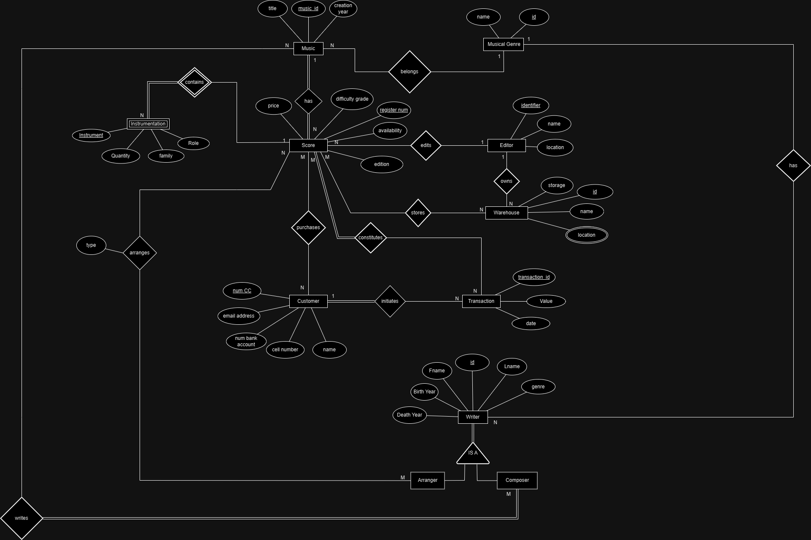

# BD: Trabalho Prático APFE

**Grupo**: P5G4

- Jorge Domingues, MEC: 113278
- João Monteiro, MEC: 114547

## Introdução / Introduction

Escreva uma pequena introdução sobre o trabalho.
Write a simple introduction about your project.

O objetivo deste trabalho é projetar e analisar a estrutura de uma base de dados para um site dedicado à venda e compra de partituras musicais. Neste projeto o utilizador poderá pesquisar por partituras pelo género, ou pelo compositor e publicar partituras originais ou arranjos de outras obras.

## ​Análise de Requisitos / Requirements

- Publicar partituras;
- Pesquisar partituras;
- Pesquisar partituras pelo nome;
- Pesquisar partituras pelo género musical;
- Pesquisar partituras pelo compositor;
- Vender partituras;

## DER

## ER

