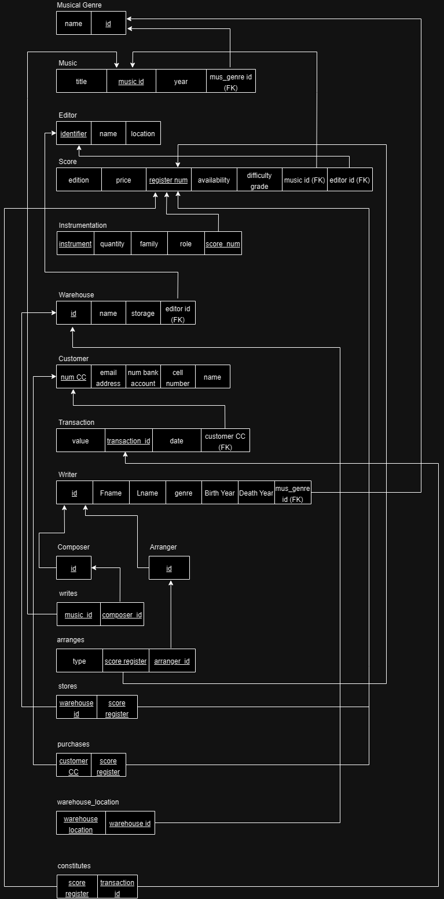

# BD: Trabalho Prático APFE

**Grupo**: P5G4

- Jorge Domingues, MEC: 113278
- João Monteiro, MEC: 114547

## Introdução / Introduction

O objetivo deste trabalho é projetar uma estrutura de uma base de dados para um site dedicado à venda e compra de partituras musicais. Neste projeto, o utilizador poderá pesquisar partituras como por exemplo por género ou pelo compositor, além de poder publicar partituras originais ou arranjos de outras obras. As obras estão associadas a diferentes géneros musicais, os quais, por sua vez, podem ter instrumentações diversas. Estas obras podem também estar ligadas a uma editora e estar disponíveis para compra física, estando localizadas num armazém. Para além disto, poderemos efetuar as transações assim como verificar quais as obras já adquiridas.

## ​Análise de Requisitos / Requirements

- Publicar partituras;
- Pesquisar partituras;
- Pesquisar partituras pelo nome;
- Pesquisar partituras pelo género musical;
- Pesquisar partituras pelo compositor;
- Pesquisar partituras pela instrumentação;
- Pesquisar partituras por filtros (preço ou avaliação);
- Pesquisar partituras por filtros (arranjos ou originais);
- Verificar quais as obras já adquiridas;
- Saber quais as obras associadas a cada editora;
- Saber quais as obras disponíveis em armazém;
- Vender partituras;

## DER

## ER

